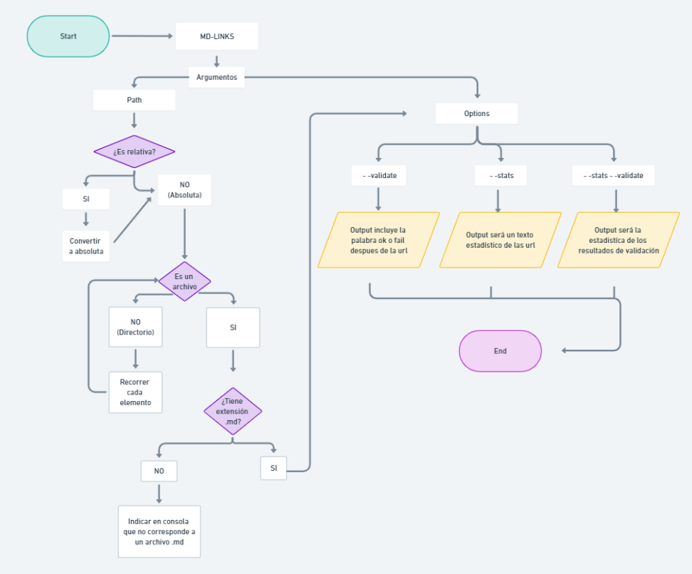

# md-links-bele

md-links-bele es una herramienta que analiza archivos Markdown y extrae los enlaces encontrados en ellos brindando diferentes estadisticas de acuerdo a las opciones que accedas. 
## Instalación

Puedes instalar md-links-bele utilizando npm. Ejecuta el siguiente comando en tu terminal: 
`npm install <github-belenoese>/md-links-bele`

## Guía de uso

Para ejecutar mdLinks ejecuta el siguiente comando desde la terminal:
`md-links-bele <path-to-file> [options]`

Por ejemplo:

```sh
$ md-links-bele ./some/example.md
./some/example.md http://algo.com/2/3/ Link a algo
./some/example.md https://otra-cosa.net/algun-doc.html algún doc
./some/example.md http://google.com/ Google
```
El comportamiento identifica el archivo Markdown, analiza su contenido e imprime los enlaces encontrados junto con la ruta del archivo y el texto del enlace.

## Opciones
### `--validate`
`md-links-bele <path-to-file> --validate`

Si se pasa esta opción, md-links-bele realizará una petición HTTP para verificar si los enlaces son válidos.

Por ejemplo:

```sh
$ md-links-bele ./some/example.md --validate
./some/example.md http://algo.com/2/3/ ok 200 Link a algo
./some/example.md https://otra-cosa.net/algun-doc.html fail 404 algún doc
./some/example.md http://google.com/ ok 301 Google
```
Como resultado el output incluirá la palabra ok o fail después de la URL, así como el status de la respuesta recibida a la petición HTTP a dicha URL.

### `--stats`
`md-links-bele <path-to-file> --stats`

Si pasamos la opción `--stats` el output (salida) será un texto con estadísticas
básicas sobre los links.

```sh
$ md-links-bele ./some/example.md --stats
Total: 3
Unique: 3
```

También podemos combinar `--stats` y `--validate` para obtener estadísticas que
necesiten de los resultados de la validación.

```sh
$ md-links-bele ./some/example.md --stats --validate
Total: 3
Unique: 3
Broken: 1
```
## Sobre el proyecto
[Markdown](https://es.wikipedia.org/wiki/Markdown) es un lenguaje de marcado
ligero muy popular entre developers. Es usado en muchísimas plataformas que
manejan texto plano (GitHub, foros, blogs, ...) y es muy común
encontrar varios archivos en ese formato en cualquier tipo de repositorio
(empezando por el tradicional `README.md`).

Estos archivos `Markdown` normalmente contienen _links_ (vínculos/ligas) que
muchas veces están rotos o ya no son válidos y eso perjudica mucho el valor de
la información que se quiere compartir.

Dentro de una comunidad de código abierto, nos han propuesto crear una
herramienta usando [Node.js](https://nodejs.org/), que lea y analice archivos
en formato `Markdown`, para verificar los links que contengan y reportar
algunas estadísticas.

## Diagrama de flujo


